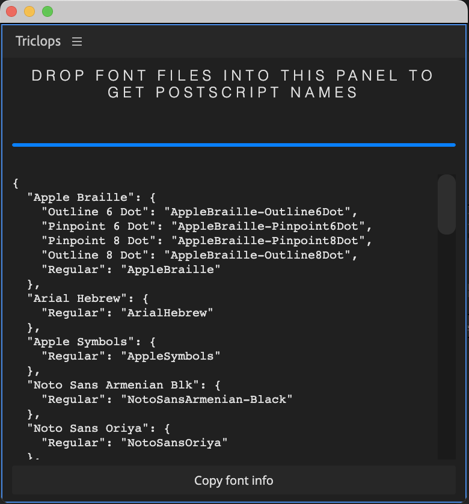

# Triclops 
### Font file info collector

Drop font files (`.ttf`, `.ttc`, `.dfont`, `.otf`) into the panel to output JSON of the fonts with Postscript names. For use with [AEUX](https://aeux.io). 




### Why do we need this?
Figma outputs [font info](https://www.figma.com/plugin-docs/api/FontName/) as an object. 

```
fontName = {
  family: string
  style: string
{
```

This works for Figma, but Adobe apps need a Postscript name. Many modern fonts follow the convention of `FontName-FontStyle` for the Postscript name so AEUX may dynamically locate fonts like this:
```
`${fontName.family.replace(/ /g, '')}-${fontName.style.replace(/ /g, '')}`
```

```
fontName = {
  family: "Fira Mono"
  style: "Regular"
}
```
Becomes:
```
FiraMono-Regular
```
Which is the correct Postscript name. Yay!

But a lot of fonts don't match this format. 🤔
- Arial Regular: `ArialMT`
- Courier Regular: `Courier`
- HelveticaNeue Regular: `HelveticaNeue`
- Times New Roman Regular: `TimesNewRomanPSMT`


Sooooooo we need to manually create a substitution list based on available fonts and their Postscript names.


#### Triclops JSON format
Dragging system fonts into the panel generates a list of fonts that do not match the `FontName-FontStyle` formatting. 
```
{
    "Arial Black": {
        "Regular": "Arial-Black"
    },
    "Arial Narrow": {
        "Bold Italic": "ArialNarrow-BoldItalic",
        "Bold": "ArialNarrow-Bold",
        "Italic": "ArialNarrow-Italic",
        "Regular": "ArialNarrow"
    },
    "Arial": {
        "Bold Italic": "Arial-BoldItalicMT",
        "Bold": "Arial-BoldMT",
        "Italic": "Arial-ItalicMT",
        "Regular": "ArialMT"
    },
    "Times New Roman": {
        "Bold Italic": "TimesNewRomanPS-BoldItalicMT",
        "Italic": "TimesNewRomanPS-ItalicMT",
        "Bold": "TimesNewRomanPS-BoldMT",
        "Regular": "TimesNewRomanPSMT"
    },
}
```